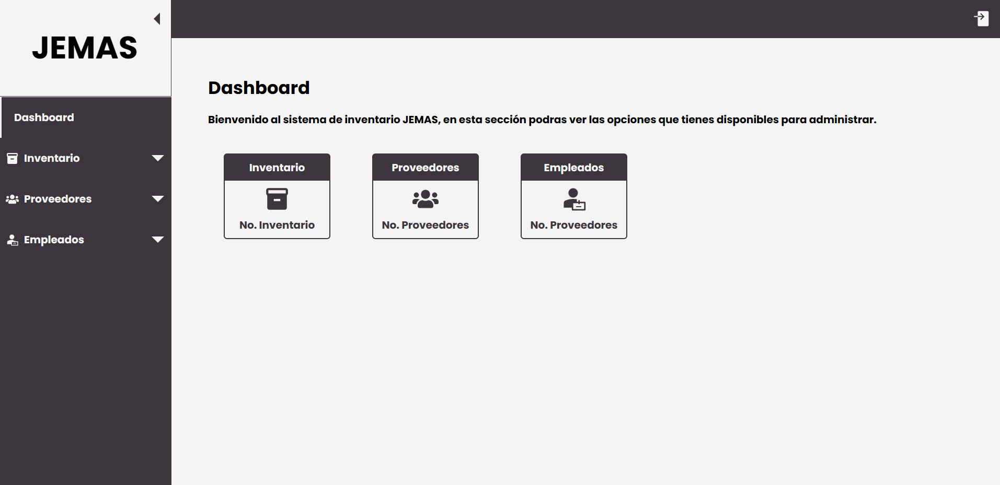
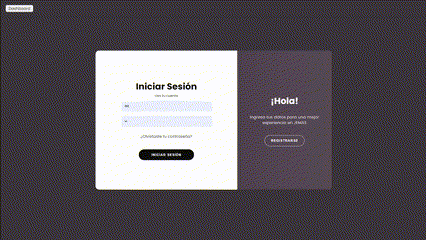

# JEMAS - Jewelry Management System

    

## Preview

    

## Descripcion del proyecto
Es un proyecto del Tercer Semestre de la Ingenieria en Software. Este se centra en el diseño, desarrollo, e implementación de un sistema para gestionar el almacén e inventario de tiendas departamentales. Utilizando una arquitectura de aplicación web CRUD (Crear, Leer, Actualizar, Eliminar).

## Integrantes del proyecto

    

## Recursos utilizados
https://icon-sets.iconify.design/ic/baseline-inventory/
https://icon-sets.iconify.design/fa-solid/users/
https://icon-sets.iconify.design/clarity/employee-solid/
https://icon-sets.iconify.design/clarity/sign-in-solid/
https://icon-sets.iconify.design/mdi/face-woman/
https://icon-sets.iconify.design/mdi/face-man/
https://icon-sets.iconify.design/map/jewelry-store/
https://icon-sets.iconify.design/mdi/filter-cog-outline/
https://icon-sets.iconify.design/circum/search/
https://icon-sets.iconify.design/ic/round-home/