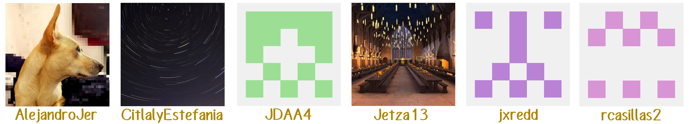

# JEMAS - Jewelry Management System    

## Descripcion del proyecto
Es un proyecto del Tercer Semestre de la Ingenieria en Software. Este se centra en el diseño, desarrollo, e implementación de un sistema para gestionar el almacén e inventario de tiendas departamentales. Utilizando una arquitectura de aplicación web CRUD (Crear, Leer, Actualizar, Eliminar).

## Integrantes del proyecto

    

